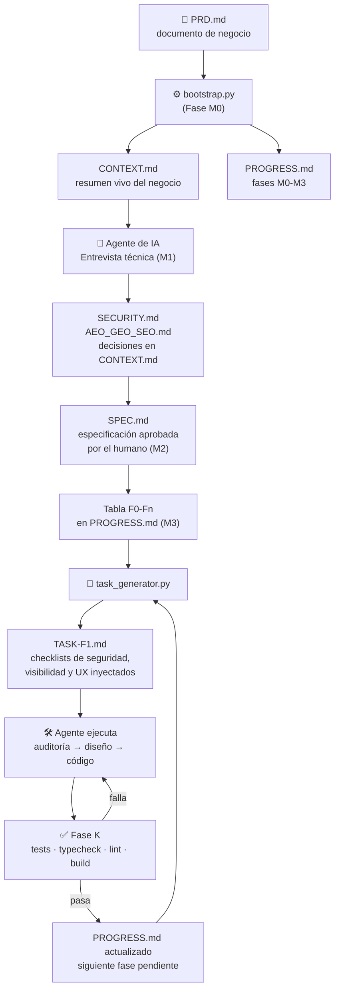

# 🧬 FIA HARNESS COMPLETO

> **El sistema operativo para construir software con agentes de IA.**
> Especificación antes que código · Seguridad por diseño · Contexto mínimo en cada fase · Cero asunciones en silencio

**📖 English:** [README.md](README.md)

[](https://github.com/mcpedrogm-art/fia-harness/actions/workflows/tests.yml)
[](https://pypi.org/project/fia-harness/)
[](#)
[](LICENSE)

&nbsp;

`Python 3.8+` · `Sin dependencias externas` · `Mono o multi-agente` · `2 modos de trabajo` · `Reglas verificadas en CI` · `LLM-agnóstico` *(funciona con DeepSeek, OpenCode, Claude, GPT o el agente que uses)*

---

## 🗺️ El sistema en un vistazo



**La idea central:** el PRD se lee una vez. A partir de ahí, cada fase del agente solo carga 4 archivos comprimidos (`CONTEXT.md` + sección de `SPEC.md` + `PROGRESS.md` + `TASK-Fx.md`). Nunca se reenvía el histórico completo. Contexto pequeño = respuestas más baratas, más rápidas y con menos deriva.

---

## ⚙️ Cómo funciona: tres motores

### 1️⃣ Fases de proceso (M0–M3) — *pensar antes de construir*

| Fase | Qué pasa | Entregable |
|:---:|---|---|
| **M0** | `bootstrap.py` lee el PRD y activa el harness | `CONTEXT.md` + `PROGRESS.md` + plantillas |
| **M1** | El agente te entrevista: stack, BBDD, seguridad, visibilidad, UI/UX, Skills/MCP | `SECURITY.md` y `AEO_GEO_SEO.md` completos |
| **M2** | El agente redacta la especificación técnica (SDD) | `SPEC.md` **aprobado por un humano** |
| **M3** | El plan se trocea en fases pequeñas y verificables | Tabla `F0-Fn` pegada en `PROGRESS.md` |

> 🚫 Hasta que M3 cierra, **no se escribe una sola línea de código de producción.**

### 2️⃣ Fases de ejecución (F0–Fn) — *construir fase a fase*

Cada fase del plan = **una tarea** = un ciclo completo y cerrado. Ejemplo de plan típico:

| Fase | Objetivo | Entregable |
|:---:|---|---|
| F0 | Bootstrap del repo, tooling, CI | Repo funcionando |
| F1 | Modelo de datos + migraciones | BBDD versionada |
| F2 | Backend core | API mínima |
| F3 | Frontend core | UI navegable |
| F4 | Auth y permisos | Login/roles |
| ... | ... | ... |

`task_generator.py` **detecta automáticamente la primera fase pendiente** y genera su tarea. Tú decides cuándo arrancar la siguiente; el agente nunca encadena fases solo.

### 3️⃣ El ciclo de tarea (A–L) — *disciplina en cada fase*

```
A. Auditoría          → inspeccionar antes de tocar
B. Diseño             → mapa mínimo alineado con SPEC.md
C. Hipótesis          → declarar decisiones, no asumirlas
E. Implementación     → cambio mínimo necesario
F. Edge cases         → idempotencia, carreras, validación
I. Tests              → escenarios mínimos obligatorios
J. No hacer / J2      → scope cerrado + checklist de seguridad
H2. Visibilidad       → SEO/AEO/GEO si hay superficie pública
H3. UI/UX             → Design DNA aprobado si hay interfaz
K. Validación         → tests · typecheck · lint · build
L. Informe final      → qué se hizo, qué no, y resultado verificado
```

Las fases H2 (Visibilidad) y J2 (Seguridad) **se inyectan automáticamente solo si la fase las necesita**, con el contenido *real y vivo* de tus `AEO_GEO_SEO.md`, `SECURITY.md` y `UI_UX_EXCLUSIVA.md`. Si no aplican, el generador lo deja escrito con su motivo — nunca se omite en silencio.

---

## 🚀 Arranque en 4 pasos

> ⚡ **O en un solo comando (PyPI):** `uvx fia-harness init` (o `pipx run fia-harness init`) monta el proyecto nuevo automáticamente — plantillas en `/docs`, scripts en la raíz y `PRD.md` de partida. Salta al paso 2.

```text
1. Prepara el proyecto nuevo
   ├── bootstrap.py + task_generator.py en la raíz
   ├── /docs con las 8 plantillas maestras
   ├── (opcional) RAG_VECTOR_EXTENSION.md dentro de /docs si habrá búsqueda semántica
   └── PRD.md en la raíz

2. python bootstrap.py          → Fase M0 automática
   Genera CONTEXT.md, PROGRESS.md, progress.json, DECISIONS.md,
   activa las plantillas y emite .github/workflows/harness.yml

3. Abre tu agente con la carpeta → inicia la entrevista (M1)
   El agente lee CONTEXT.md y NO programa nada todavía.

4. Aprueba SPEC.md, pega la tabla F0-Fn en PROGRESS.md y compila:
   python task_generator.py --sync   → valida el estado en progress.json
   python task_generator.py          → genera la tarea de la fase pendiente
```

> 📖 Guía detallada paso a paso: **[INSTRUCCIONES DE APLICACION.txt](INSTRUCCIONES%20DE%20APLICACION.txt)** · Protocolo completo: **[INICIO_PROYECTO.md](INICIO_PROYECTO.md)**

---

## 📁 Mapa de archivos

| Archivo | Qué es |
|---|---|
| 🧭 `INICIO_PROYECTO.md` | **Fuente de verdad del protocolo**: rol del agente, fases, entrevista técnica, reglas de oro |
| ⚙️ `bootstrap.py` | Inicializador (M0): lee el PRD, genera `CONTEXT.md`/`PROGRESS.md`/`progress.json`/`DECISIONS.md`, activa plantillas y RAG si procede, y emite el CI de reglas de oro |
| 🤖 `task_generator.py` | Genera cada `TASK-Fx.md`, compila/valida el estado (`--sync`, `--check`) y registra aprobaciones (`--approval`) |
| 📦 `fia_harness/` + `pyproject.toml` | Paquete PyPI: `fia-harness init` (CLI instalador). Las copias de scripts/plantillas del paquete están vigiladas por tests de sincronización |
| 🗃️ `progress.json` | Estado compilado y validado del proyecto: la máquina de verdad que lee el CI |
| 📋 `TASK_TEMPLATE.md` | Plantilla maestra de tarea (ciclo completo A–L, 20 puntos de informe) |
| ⚡ `TASK_LITE_TEMPLATE.md` | Plantilla de tarea rápida para el Modo Lite |
| 🛡️ `SECURITY.md` | Checklist de seguridad **obligatorio en todo proyecto**: auth/2FA, RLS, secretos, firewall, Skills/MCP, prompt injection |
| 🔎 `AEO_GEO_SEO.md` | Visibilidad en tres motores: SEO (buscadores), AEO (asistentes) y GEO (LLMs) — solo si hay superficie pública |
| 🎨 `UI_UX_EXCLUSIVA.md` | Design DNA, arquetipos, motion system y auditoría anti-clon |
| 🔌 `SKILLS_MCP.md` | Gobernanza de capacidades: nada se busca/instala/conecta sin **aprobación humana explícita** |
| ⚡ `QUICKSTART_LITE.md` | Protocolo reducido para prototipos, con promoción obligatoria si aparece riesgo |
| 🧩 `PROYECTOS RAG Y VECTORIALES/` | Módulo de extensión: stack vectorial (pgvector/Pinecone/Qdrant), chunking, recuperación híbrida + reranking, `llms.txt` |
| 🧪 `tests/test_harness.py` | Tests automatizados de los parsers y del ciclo completo |
| 📜 `CHANGELOG_FIXES.md` | Historial de correcciones aplicadas y cómo se verificaron |

---

## ⚡ Dos modos de trabajo

| | 🔵 **Completo** | ⚡ **Lite** |
|---|---|---|
| Para | MVPs, productos reales | Prototipos, vertical slices, cambios acotados |
| Documentación | `CONTEXT` + `SPEC` + `PROGRESS` + `DECISIONS` | Solo `QUICK_CONTEXT.md` |
| Tareas | `TASK-Fx.md` desde `TASK_TEMPLATE.md` | `TASK-QUICK.md` desde `TASK_LITE_TEMPLATE.md` |
| Seguridad, aprobación humana, Context7 | ✅ Siempre | ✅ Siempre (no se negocian) |

**Promoción automática a Completo** si aparece cualquiera de estos: auth/roles, pagos, PII/salud, migraciones críticas, escritura en servicios externos, deploy/secretos, alcance incierto. La promoción **conserva** el trabajo ya validado.

> Para activar Lite: declara `Modo de trabajo: Lite` en `CONTEXT.md` (lo detecta `task_generator.py` solo) o fuerza con `--lite`.

---

## 🧩 Módulos condicionales

El harness base es común; estas capas se activan solo cuando el proyecto las necesita:

| Condición | Módulo que se activa |
|---|---|
| El PRD menciona RAG, embeddings, búsqueda semántica o memoria vectorial | `RAG_VECTOR_EXTENSION.md` — *bootstrap.py lo detecta y copia solo* |
| Hay páginas públicas indexables (landing, blog, docs) | `AEO_GEO_SEO.md` + Fase H2 en las tareas de contenido |
| Hay interfaz de usuario | `UI_UX_EXCLUSIVA.md` + Design DNA aprobado antes de implementar |
| El proyecto es multi-agente | `AGENTS.md` con roles y protocolo de handoff |

---

## 🚨 Enforcement: las reglas tienen dientes *(nuevo en v2)*

Un harness de documentos obliga por convención; este kit desde la v2 obliga también por infraestructura. `bootstrap.py` emite un workflow de GitHub Actions (`.github/workflows/harness.yml`) que se ejecuta en cada push y PR:

| Regla de oro | Cómo se hace cumplir mecánicamente |
|---|---|
| Nunca cerrar fases con dependencias abiertas (nº4) | `progress.json` validado: cerrar F2 con F1 abierta **rompe el build** |
| Nunca cerrar una fase sin Definition of Done (nº5) | Toda fase `done` exige su checkpoint de contexto en `PROGRESS.md` |
| Nunca ejecutar una fase sin su `TASK-Fx.md` (nº7) | El validador comprueba que `TASK-F<N>.md` exista para cada fase F cerrada |
| Nunca hacer commit con secretos (nº8) | **gitleaks** escanea todo el historial en cada push |
| Dependencias sin vulnerabilidades conocidas | `npm audit` / `pip-audit` según el stack detectado |
| Tests obligatorios antes de dar una fase por cerrada | Job de CI con pytest/unittest o `npm test`, según lo que detecte |
| Aprobaciones humanas rastreables | Toda `APPROVAL-NNN` citada en una TASK debe existir en `DECISIONS.md` |

El flujo de estado: `PROGRESS.md` sigue siendo la superficie de edición (humano o agente), y `task_generator.py --sync` lo compila y valida en `progress.json`. Si editas el Markdown a mano y no compila, el CI se pone rojo hasta que hagas `--sync`. Y `--sync` es *fail-closed*: si el estado viola una regla, **no escribe nada**.

```bash
python task_generator.py --sync      # compila y valida PROGRESS.md -> progress.json
python task_generator.py --check     # valida sin modificar nada (lo ejecuta el CI)
python task_generator.py --approval "instalar Skill X v1.2" --phase F2 --ref "chat 5-sep"
```

---

## 🛡️ Las reglas que nunca se rompen

1. 🚫 **Nunca codificar sin spec aprobada** — ni una línea antes del M3.
2. 🗣️ **Nunca asumir en silencio** — toda asunción se declara y se confirma.
3. 📦 **Nunca reenviar contexto innecesario** — los archivos de control son la fuente comprimida.
4. ✅ **Nunca cerrar una fase sin su Definition of Done** — ni mezclar fases.
5. 🔐 **Nunca cerrar una fase de seguridad sin su checklist** — la seguridad no se pospone a un audit final.
6. 🙋 **Nunca instalar/buscar/conectar una Skill, MCP o librería sin aprobación humana** — el silencio no es permiso.
7. 🧪 **Nunca inventar resultados** — los tests que no se ejecutaron no existen.
8. 🛑 **Nunca hacer commit/push/deploy sin autorización explícita.**

> 🚨 Desde la v2, las reglas 4, 5, 7 y 8 además se **verifican automáticamente en CI** en cada proyecto que arranca con `bootstrap.py` (sección anterior).

---

## ✅ Verificar el kit

```bash
python -m unittest discover tests -v
```

Los tests cubren el parser de `PROGRESS.md` (tablas múltiples, negritas, columnas combinadas), la extracción de secciones con tablas reales, los inyectores por marcadores, la heurística de palabras clave (incluido el falso positivo clásico de *"entre**vista**"*), el recorte de plantilla, la detección de Modo Lite, la **máquina de estado** (dependencias, checkpoints, TASKs, aprobaciones, drift y fail-closed) y un **ciclo completo e2e** (`bootstrap.py` → `task_generator.py`) en carpeta temporal.

En un proyecto ya arrancado, puedes comprobar su estado en cualquier momento:

```bash
python task_generator.py --check
```

---

## 📜 Documentación y fuentes de verdad

| Documento | Rol |
|---|---|
| `README.md` / `README.es.md` | Índice y visión general del sistema (EN / ES) |
| `INICIO_PROYECTO.md` | **Fuente de verdad del protocolo** — si algo diverge, manda este |
| `INSTRUCCIONES DE APLICACION.txt` | Guía rápida de arranque paso a paso |
| `guia-automatizacion-tareas.md` | Guía del generador de tareas |
| `PROTOCOLO DE GESTION....txt` | Síntesis ejecutiva (lectura rápida, no se actualiza con cada cambio) |
| `Guia_arranque_del_proyecto.pdf` | Snapshot estático de la guía para lectura cómoda |
| `CHANGELOG_FIXES.md` | Qué se corrigió, por qué y cómo se verificó |
