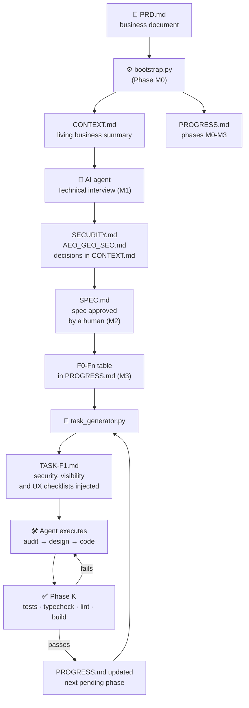

# 🧬 FIA HARNESS

> **An operating system for building software with AI agents.**
> Spec before code · Security by design · Minimal context per phase · No silent assumptions

[](https://github.com/mcpedrogm-art/fia-harness/actions/workflows/tests.yml)
[](https://pypi.org/project/fia-harness/)
[](#)
[](LICENSE)

`Python 3.8+` · `Zero external dependencies` · `Single or multi-agent` · `2 working modes` · `Rules verified in CI` · `LLM-agnostic` *(works with Claude, DeepSeek, GPT, OpenCode, or whatever agent you use)*

**📖 Español:** [README.es.md](README.es.md)

---

## ⚡ Install in one command

```bash
uvx fia-harness init        # or: pipx run fia-harness init
```

Sets up a new project instantly: the kit templates in `/docs`, the two scripts
at the root and a starter `PRD.md`. Then `python bootstrap.py` and you're on
rails. Prefer cloning? This repo is a **GitHub template** — click
*Use this template*.

## 🎬 See the interlock catch the agent (60 seconds)

The rules here are not advice — they are **merge checks** that no agent can
skip. Don't take our word for it: the
**[`fia-harness-demo`](https://github.com/mcpedrogm-art/fia-harness-demo)** repo
is a real, small project whose CI blocks a cheater agent that tries to close a
phase without its task file or checkpoint:

[](https://github.com/mcpedrogm-art/fia-harness-demo/actions/workflows/harness.yml)

```bash
git clone https://github.com/mcpedrogm-art/fia-harness-demo.git && cd fia-harness-demo
python task_generator.py --check     # ✅ green
copy PROGRESS.F2_tampered.md PROGRESS.md
python task_generator.py --check     # ❌ exit 1 — the merge is blocked
```

---

## 🗺️ The system at a glance



**The core idea:** the PRD is read once. From then on, each agent phase loads
only 4 compressed files (`CONTEXT.md` + a slice of `SPEC.md` + `PROGRESS.md` +
`TASK-Fx.md`). The full history is never re-sent. Small context = cheaper,
faster answers with less drift.

---

## ⚙️ How it works: three engines

### 1️⃣ Process phases (M0–M3) — *think before building*

| Phase | What happens | Deliverable |
|:---:|---|---|
| **M0** | `bootstrap.py` reads the PRD and activates the harness | `CONTEXT.md` + `PROGRESS.md` + templates |
| **M1** | The agent interviews you: stack, DB, security, visibility, UI/UX, Skills/MCP | `SECURITY.md` and `AEO_GEO_SEO.md` filled in |
| **M2** | The agent writes the technical spec (SDD) | `SPEC.md` **approved by a human** |
| **M3** | The plan is split into small, verifiable phases | `F0-Fn` table pasted into `PROGRESS.md` |

> 🚫 Until M3 closes, **not a single line of production code is written.**

### 2️⃣ Execution phases (F0–Fn) — *build phase by phase*

Each planned phase = **one task** = one complete, closed cycle. Typical plan:

| Phase | Objective | Deliverable |
|:---:|---|---|
| F0 | Repo bootstrap, tooling, CI | Working repo |
| F1 | Data model + migrations | Versioned DB |
| F2 | Backend core | Minimal API |
| F3 | Frontend core | Navigable UI |
| F4 | Auth and permissions | Login/roles |
| ... | ... | ... |

`task_generator.py` **auto-detects the first pending phase** and generates its
task. You decide when to start the next one; the agent never chains phases on
its own.

### 3️⃣ The task cycle (A–L) — *discipline inside every phase*

```
A. Audit               → inspect before touching
B. Design              → minimal map aligned with SPEC.md
C. Hypotheses          → declare decisions, don't assume
E. Implementation      → minimal change needed
F. Edge cases          → idempotency, races, validation
I. Tests               → minimal mandatory scenarios
J. Don't-do / J2       → closed scope + security checklist
H2. Visibility         → SEO/AEO/GEO if there's a public surface
H3. UI/UX              → approved Design DNA if there's an interface
K. Validation          → tests · typecheck · lint · build
L. Final report        → what was done, what wasn't, verified result
```

Phases H2 (Visibility) and J2 (Security) are **injected automatically only if
the phase needs them**, with the *real, living* content of your
`AEO_GEO_SEO.md`, `SECURITY.md` and `UI_UX_EXCLUSIVA.md`. If they don't apply,
the generator says so explicitly — never omitted in silence.

---

## 🚀 Getting started in 4 steps

> ⚡ **Or in one command (PyPI):** `uvx fia-harness init` mounts the new project
> automatically — templates in `/docs`, scripts at the root, starter `PRD.md`.
> Skip to step 2.

```text
1. Prepare the new project
   ├── bootstrap.py + task_generator.py at the root
   ├── /docs with the 8 master templates
   ├── (optional) RAG_VECTOR_EXTENSION.md inside /docs if there will be semantic search
   └── PRD.md at the root

2. python bootstrap.py          → automatic Phase M0
   Generates CONTEXT.md, PROGRESS.md, progress.json, DECISIONS.md,
   activates the templates and emits .github/workflows/harness.yml

3. Open your agent with the folder → the interview starts (M1)
   The agent reads CONTEXT.md and does NOT code anything yet.

4. Approve SPEC.md, paste the F0-Fn table into PROGRESS.md and compile:
   python task_generator.py --sync   → validates the state into progress.json
   python task_generator.py          → generates the task for the pending phase
```

> 📖 Step-by-step guide: **[INSTRUCCIONES DE APLICACION.txt](INSTRUCCIONES%20DE%20APLICACION.txt)** (ES) · Full protocol: **[INICIO_PROYECTO.md](INICIO_PROYECTO.md)** (ES)

---

## 📁 File map

| File | What it is |
|---|---|
| 🧭 `INICIO_PROYECTO.md` | **Source of truth of the protocol**: agent role, phases, technical interview, golden rules |
| ⚙️ `bootstrap.py` | Bootstrapper (M0): reads the PRD, generates `CONTEXT.md`/`PROGRESS.md`/`progress.json`/`DECISIONS.md`, activates templates and RAG when needed, and emits the golden-rules CI |
| 🤖 `task_generator.py` | Generates each `TASK-Fx.md`, compiles/validates state (`--sync`, `--check`) and registers approvals (`--approval`) |
| 📦 `fia_harness/` + `pyproject.toml` | PyPI package: `fia-harness init` (installer CLI). Package copies are watched by sync tests |
| 🗃️ `progress.json` | Compiled, validated project state: the machine truth the CI reads |
| 📋 `TASK_TEMPLATE.md` | Master task template (full A–L cycle, 20-point report) |
| ⚡ `TASK_LITE_TEMPLATE.md` | Quick task template for Lite mode |
| 🛡️ `SECURITY.md` | Security checklist **mandatory in every project**: auth/2FA, RLS, secrets, firewall, Skills/MCP, prompt injection |
| 🔎 `AEO_GEO_SEO.md` | Visibility across three engines: SEO (search), AEO (assistants) and GEO (LLMs) — only if there's a public surface |
| 🎨 `UI_UX_EXCLUSIVA.md` | Design DNA, archetypes, motion system and anti-clone audit |
| 🔌 `SKILLS_MCP.md` | Capability governance: nothing is searched/installed/connected without **explicit human approval** |
| ⚡ `QUICKSTART_LITE.md` | Reduced protocol for prototypes, with mandatory promotion when risk appears |
| 🧩 `PROYECTOS RAG Y VECTORIALES/` | Extension module: vector stack (pgvector/Pinecone/Qdrant), chunking, hybrid retrieval + reranking, `llms.txt` |
| 🧪 `tests/` | Automated tests of the parsers, the state machine, the packaging and the full cycle |
| 📜 `CHANGELOG_FIXES.md` | History of fixes applied and how they were verified |

---

## ⚡ Two working modes

| | 🔵 **Full** | ⚡ **Lite** |
|---|---|---|
| For | MVPs, real products | Prototypes, vertical slices, bounded changes |
| Documentation | `CONTEXT` + `SPEC` + `PROGRESS` + `DECISIONS` | Just `QUICK_CONTEXT.md` |
| Tasks | `TASK-Fx.md` from `TASK_TEMPLATE.md` | `TASK-QUICK.md` from `TASK_LITE_TEMPLATE.md` |
| Security, human approval | ✅ Always | ✅ Always (never negotiable) |

**Automatic promotion to Full** if any of these appear: auth/roles, payments,
PII/health, critical migrations, writes to external services, deploy/secrets,
uncertain scope. Promotion **keeps** the already-validated work.

> To enable Lite: declare `Modo de trabajo: Lite` in `CONTEXT.md`
> (detected automatically by `task_generator.py`) or force it with `--lite`.

---

## 🧩 Conditional modules

The base harness is common; these layers activate only when a project needs them:

| Condition | Module activated |
|---|---|
| The PRD mentions RAG, embeddings, semantic search or vector memory | `RAG_VECTOR_EXTENSION.md` — *detected and copied by bootstrap.py* |
| There are public indexable pages (landing, blog, docs) | `AEO_GEO_SEO.md` + Phase H2 in content tasks |
| There is a user interface | `UI_UX_EXCLUSIVA.md` + approved Design DNA before implementing |
| The project is multi-agent | `AGENTS.md` with roles and handoff protocol |

---

## 🚨 Enforcement: the rules have teeth

A documents-only harness enforces by convention; this kit, since v2, also
enforces by infrastructure. `bootstrap.py` emits a GitHub Actions workflow
(`.github/workflows/harness.yml`) that runs on every push and PR:

| Golden rule | How it's mechanically enforced |
|---|---|
| Never close phases with open dependencies (#4) | Validated `progress.json`: closing F2 with F1 open **breaks the build** |
| Never close a phase without a Definition of Done (#5) | Every `done` phase requires its context checkpoint in `PROGRESS.md` |
| Never run a phase without its `TASK-Fx.md` (#7) | The validator requires `TASK-F<N>.md` for every closed F phase |
| Never commit secrets (#8) | **gitleaks** scans the full history on every push |
| No dependencies with known vulnerabilities | `npm audit` / `pip-audit` according to the detected stack |
| Mandatory tests before closing a phase | CI job with pytest/unittest or `npm test`, whatever it detects |
| Traceable human approvals | Every `APPROVAL-NNN` cited in a TASK must exist in `DECISIONS.md` |

State flow: `PROGRESS.md` remains the editing surface (human or agent), and
`task_generator.py --sync` compiles and validates it into `progress.json`. If
you edit the Markdown by hand and don't compile, CI turns red until you run
`--sync`. And `--sync` is *fail-closed*: if the state violates a rule, **it
writes nothing**.

```bash
python task_generator.py --sync      # compiles and validates PROGRESS.md -> progress.json
python task_generator.py --check     # validates without modifying anything (CI runs this)
python task_generator.py --approval "install Skill X v1.2" --phase F2 --ref "chat 5-sep"
```

---

## 🛡️ The rules that never break

1. 🚫 **Never code without an approved spec** — not a line before M3.
2. 🗣️ **Never assume in silence** — every assumption is declared and confirmed.
3. 📦 **Never re-send unnecessary context** — the control files are the compressed source.
4. ✅ **Never close a phase without its Definition of Done** — and never mix phases.
5. 🔐 **Never close a security phase without its checklist** — security is not postponed to a final audit.
6. 🙋 **Never install/search/connect a Skill, MCP or library without human approval** — silence is not permission.
7. 🧪 **Never invent results** — tests that didn't run don't exist.
8. 🛑 **Never commit/push/deploy without explicit authorization.**

> 🚨 Since v2, rules 4, 5, 7 and 8 are also **verified automatically in CI** on
> every project that starts with `bootstrap.py` (previous section).

---

## 🐕 Dogfooding

This repository is governed by the kit it ships:

- The badge above is this repo's own CI: **56 tests** plus a **self-application
  job** that runs `fia-harness init` → `bootstrap.py` → `--check` on a fresh
  temp project in every push.
- The [`fia-harness-demo`](https://github.com/mcpedrogm-art/fia-harness-demo)
  repo is generated with the kit and its golden-rules CI catches the cheater
  agent live.

---

## ✅ Verify the kit

```bash
python -m unittest discover tests -v
```

The tests cover the `PROGRESS.md` parser (multiple tables, bold, combined
columns), section extraction with real tables, marker-based injectors, keyword
heuristics (including the classic *"entre**vista**"* false positive), template
header trimming, Lite-mode detection, the **state machine** (dependencies,
checkpoints, TASKs, approvals, drift and fail-closed), the **packaging**
(anti-drift copies, `init` e2e, cp1252 consoles) and a **complete e2e cycle**
(`bootstrap.py` → `task_generator.py`) in a temp folder.

In a bootstrapped project, check its state at any time:

```bash
python task_generator.py --check
```

---

## 📜 Documentation and sources of truth

| Document | Role |
|---|---|
| `README.md` *(this file)* | Index and system overview (English) |
| `README.es.md` | The same overview in Spanish |
| `INICIO_PROYECTO.md` | **Source of truth of the protocol** — if anything diverges, this one rules |
| `INSTRUCCIONES DE APLICACION.txt` | Quick step-by-step start guide (ES) |
| `guia-automatizacion-tareas.md` | Task generator guide (ES) |
| `PROTOCOLO DE GESTION....txt` | Executive summary (quick read, ES) |
| `Guia_arranque_del_proyecto.pdf` | Static snapshot of the guide for comfortable reading (ES) |
| `CHANGELOG_FIXES.md` | What was fixed, why and how it was verified |

---

## 📄 License

MIT — see [LICENSE](LICENSE). The kit is yours: local, auditable, no cloud, no
telemetry, no accounts.
